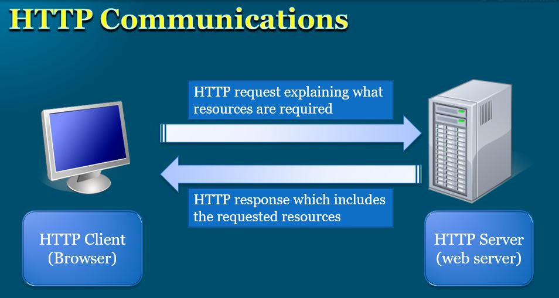
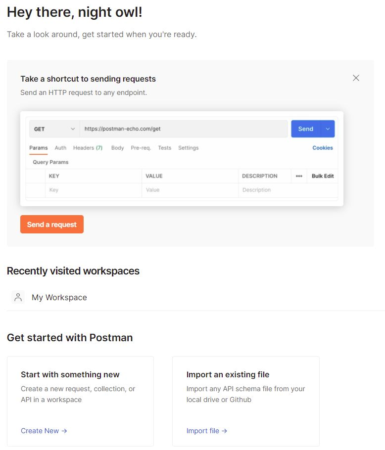
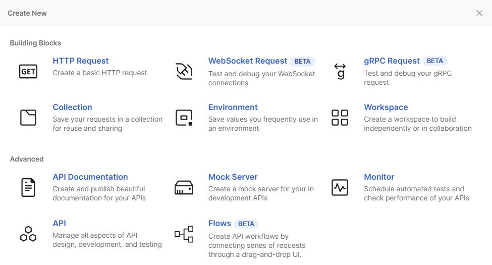
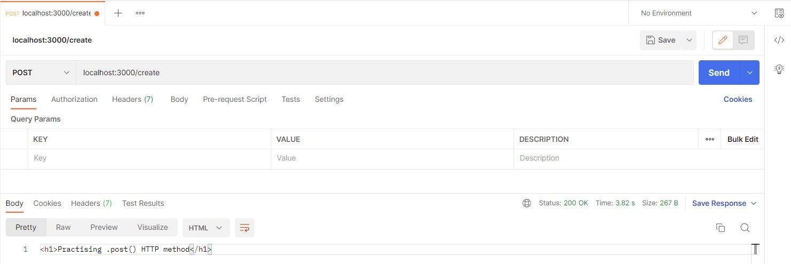
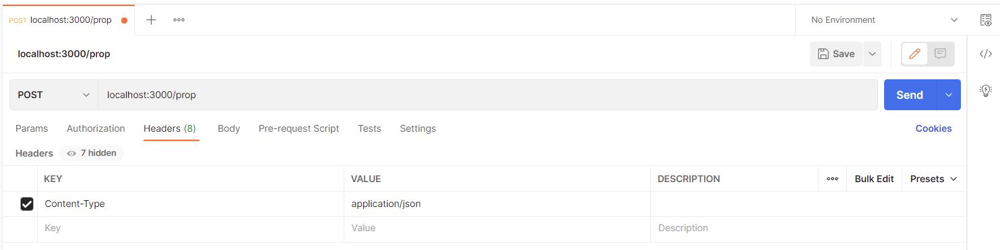
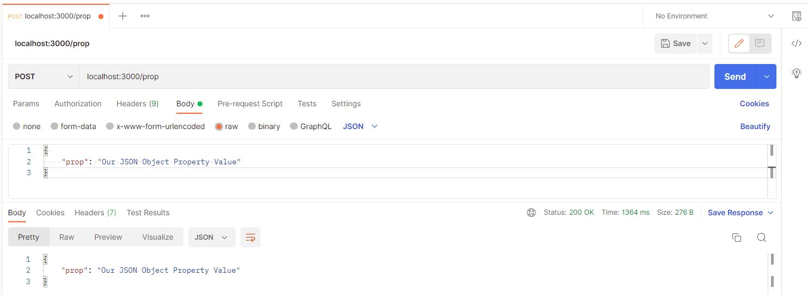
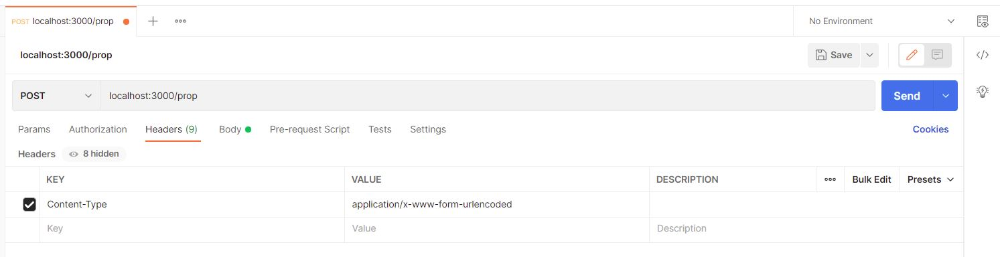
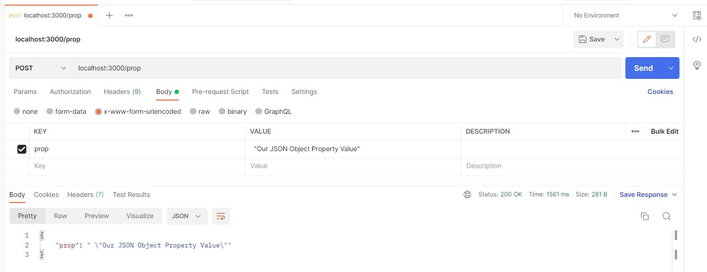

# Express-Basics
A quick introduction to "Express", the minimalist web framework for Node.js 

Quick Demonstration for creating a web server based on the Express JS "Getting Started" and "Guide" :-)
- [ExpressJS.com](https://expressjs.com/)
- [Express web framework (Node.js/JavaScript)](https://developer.mozilla.org/en-US/docs/Learn/Server-side/Express_Nodejs)
- [nodemon npm](https://www.npmjs.com/package/nodemon)
- [nodemon.io](https://nodemon.io/)
- ["Mockaroo.com"](https://www.mockaroo.com/)
- [Postman](https://www.postman.com/)

# Repo Code Files:
This repo includes the following JavaScript files. To clearly understand Express, you should go with the following sequence. Also this readme file will show you the relevant code file based on each topic.
- index1.js
- index2.js
- index3.js
- index4.js
- index5.js
- index6.js

# Installation:
The installation steps were taken form [ExpressJS](https://expressjs.com/en/starter/installing.html)
1. You have already installed Node.js, create a directory/folder to hold your application, and make that your working directory. In my case it's the same as its remote repo name "express-basics"
    - Open VS Code Terminal, You can click the arrow to choose your favourite CLI:
        - GitBash (the cross-platform CLI)
        - Powershell (Only for Windows users)
    - You can check if you have node.js by running this command to check its version:
        - node -v

2. Use the npm init command to create a "package.json" file for your application. For more information on how package.json works, see Specifics of npm’s package.json handling.

> npm init

You can add -y to skip all the questions:

> npm init -y

This command will create a "package.json" file that contains information about the application and much more important the "dependencies" package(s). No packages is shown at the beginning:
```
{
  "name": "express-basics",
  "version": "1.0.0",
  "description": "The basics of Express.JS",
  "main": "index.js",
  "scripts": {
    "test": "echo \"Error: no test specified\" && exit 1"
  },
  "repository": {
    "type": "git",
    "url": "git+https://github.com/anmarjarjees/express-basics.git"
  },
  "keywords": [
    "ExpressJS"
  ],
  "author": "Anmar Jarjees",
  "license": "ISC",
  "bugs": {
    "url": "https://github.com/anmarjarjees/express-basics/issues"
  },
  "homepage": "https://github.com/anmarjarjees/express-basics#readme"
}
```
You will have the following content:


3. Enter app.js, sever.js, or whatever you want the name of the main file to be. If you want it to be index.js, hit RETURN to accept the suggested default file name which will be "index.js".

Now install Express in your working directory and save it in the dependencies list. For example:
> npm install express
Or just using "i" for install:
> npm i express

To install Express temporarily and not add it to the dependencies list:
> npm install express --no-save

After installing "express", your folder will have these two new content:
- node_modules
- package-lock.json

Plus modifying the "package.json" file. After install "express", you will have the dependencies package:
```
"dependencies": {
    "express": "^4.18.1"
}
```
4. Create your starting point JS file like: index.js, app.js, or...
refer to my code file: index.js

5. Another optional package but very important is called "nodemon". Based on what they say in nodemon official website: Nodemon is a utility that will monitor for any changes in your source code and automatically restart your server. In other word, it will restart your server automatically every time you save your file.
- [nodemon npm](https://www.npmjs.com/package/nodemon)
- [nodemon.io](https://nodemon.io/)
- You can install nodemon as a dependency:
> npm install nodemon
- Or installing nodemon as a development dependency: [npm install <package-name> --save-dev]
> npm install nodemon --save-dev  

The differences between dependency and development dependency:
- "dependencies": Packages required by your application in production.
- "devDependencies": Packages that are only needed for local development and testing

To learn more, check this article ["Specifying dependencies and devDependencies in a package.json file"](https://docs.npmjs.com/specifying-dependencies-and-devdependencies-in-a-package-json-file)

inside package.json, you can see that "express" is for sure onr of the dependencies, while "nodemon" is mainly needed for development:
```
  "dependencies": {
    "express": "^4.18.1"
  },
  "devDependencies": {
    "nodemon": "^2.0.19"
  }
```
NOTE:
You can install more than one package together within a single command:
> npm install express nodmon

6. Modify the package.json file manually by replacing the property "test" of the script below:
```
- The default initial code:
    "scripts": {
        "test": "echo \"Error: no test specified\" && exit 1"
    },
```
- the new updated code:
```
   "scripts": {
    "start": "nodemon"
  },
```
Tip: 
Since your application entry point file named "index", so you can exclude the file name:
    - You can just write:
        > "start": "nodemon"

But remember that if your entry point js file has different name, you will have to specify

Finally, one more last change, if you are planning to load JSON files, you will have to specify this also:
    - add a separate flag "--experimental-json-modules" to enable experimental support for import of JSON files. 
 You can read more about this topic in this old article about ["--experimental-modules"](https://nodejs.medium.com/announcing-a-new-experimental-modules-1be8d2d6c2ff)
```
 "scripts": {
    "start": "nodemon --experimental-json-modules"
  },
```
Swap nodemon instead of node to run your code, and now your process will automatically restart when your code changes."

7. One more optional but good change, remember that in node.js we used require() function to include other modules as it's the original way to import/embed modules since the first versions of node.js and still working with the new versions. However, we can also use the "import" with "exports" command going with the new versions to import modules. This technique has been introduced in ES6. So if you like to go with this option, you will need to modify the "package,json" file by adding the property and value ["type": "module"]. Here is what VS Code will tell your *"When set to "module", the type field allows a package to specify all .js files within are ES modules. If the "type" field is omitted or set to "commonjs", all .js files are treated as CommonJS."*:<br>
You can add it anywhere at the beginning:
```
{
  "type": "module",
  "name": "express-basics",
  "version": "1.0.0",
  "description": "The basics of Express.JS",
  "main": "index.js",
```

8. Now, you can create your entry point js file "index.js"

9. to run the app:
- The default command (assuming that the file is index.js), notice that no need to specify .js extension as note will default it to .js:
    > node index
    <br>Or since the file name is "index" we can even use this code as we learnt with node.js:
    > node .
    <br>Otherwise, you have to specify:<br>
    > node index1
- The run command after installing nodemon:
    > npm run dev
    <br>OR just use this command assuming that the entry point file is "index.js":<br>
    > npm start
    <br>if you want to run other file as an entry point to your app and the name is not index, you have to write the name:
    > npm start index2

 |***:computer: Code Reference: index1.js***|
 |:---:|

# Response methods
The methods on the response object (res) in the following table can send a response to the client, and terminate the request-response cycle. If none of these methods are called from a route handler, the client request will be left hanging.

Method => Description
- res.download() => Prompt a file to be downloaded (a file will be transferred as an attachment).
- res.end() =>	End the response process. 
- res.json() =>	Send a JSON response. { The one that we will be focusing on in our current project }
- res.jsonp() =>	Send a JSON response with JSONP support.
- res.redirect() =>	Redirect a request (Redirect the user to another specified path).
- res.render() =>	Render a view template.
- res.send() =>	Send a response of various types. { The one that we will be focusing on in our current project }
- res.sendFile() =>	Send a file as an octet stream.
- res.sendStatus() =>	Set the response status code and send its string representation as the response body.

You can install another package named "nodemon server" which is a very useful tool to start your server. This will restart our server automatically for every change we make 

## API Testing:
For testing the API request, we will ["Mockaroo.com"](https://www.mockaroo.com/). Mockaroo lets you generate up to 1,000 rows of realistic test data in CSV, JSON, SQL, and Excel formats. You can check [Mocking a REST API with Mockaroo](https://youtu.be/H91_P_Zr2M0) video.

I have done the following changes:
- Changing the table by adding "Job Title" field instead of "IP Address"
- Reduce the number of returned rows to 30
- Change the format from "CSV" to "JSON"


- Then download the json file and save it into your project folder inside a sub-folder named "data" by convention.

- You can open the json file with VS code and press "ALT+SHIFT+F" to format the lines

NOTE: 
The project folder contains a sub-folder named "data", the "data" folder contains:
- mock-data.json => the JSON file that contains mock data generated by 'Mockaroo"
- info.txt => a simple text file that contains one line to practice file download

# Route - Routing:
Routing refers to how an application's endpoints (URIs) respond to client requests. 
Route is consisted of;
- a path
- an HTTP request method

## HTTP Methods:
HTTP defines a set of [request methods](https://developer.mozilla.org/en-US/docs/Web/HTTP/Methods) to indicate the desired action to be performed for a given resource. 
We can use the four HTTP methods: Create, Read, Update, and Delete to implement the "CRUD" operations. So the four HTTP method for the "CRUD" are:
- GET [.get()] => The GET method requests a representation of the specified resource. Requests using GET should only retrieve data from the server
- POST [.post()] => The POST method submits an entity to the specified resource (sends data to the server), often causing a change in state or side effects on the server.
- PUT [.put()] => The PUT method replaces (updates) all current representations of the target resource with the request payload.
- DELETE [.delete()] => The DELETE method deletes the specified resource.

## HTTP Messages:
[HTTP messages](https://developer.mozilla.org/en-US/docs/Web/HTTP/Messages) are how data is exchanged between a server and a client. There are two types of messages: requests sent by the client to trigger an action on the server, and responses, the answer from the server. You can check this quick article about ["The structure of HTTP request"](https://www.oreilly.com/library/view/http-the-definitive/1565925092/ch01s05.html). Also you can learn about all the ["HTTP Status Messages"](https://www.w3schools.com/tags/ref_httpmessages.asp)
 - HTTP Request: Sending a request from the client to the server
 - HTTP Response: Sending an a response (answer) from the server to the client
 

# Postman and JSON Data
In our application we used the four commonly used HTTP methods for CRUD operations, but we are able to only test the .get() method. For trying and testing the other three method, we will use a free tool to test our Route named "Postman".

[What is Postman?](https://www.postman.com/)
Postman is an API platform for building and using APIs. Postman simplifies each step of the API lifecycle and streamlines collaboration so you can create better APIs—faster.

- Create a free account with postman.com
- Download the Desktop application based on your OS
- Run the downloaded executable file, postman will ask you either to sign in or create an account
- Since you have already created your account, sign in till you land on the home dashboard.
- From the home page, click "Create New"


- From the popup menu, select "HTTP Request":


- Change "GET" option for input box to be "POST" by just clicking the "GET" button and select the wanted method from the dropdown list which is "POST". Then enter your local URL with route value (the path) that you specified in your code<br>. Finally, click "Send" button and you will see the results based on what you have sent using res.send() method. Example, for "create", we used "localhost:3000/create":


- Now within the same page, you can repeat the same logic the following changes:
  - PUT => localhost:3000/create
  - DELETE => localhost:3000/delete
  - GET => localhost:3000/users

For the scope of this course, two things to consider:
- We will get the data from a JSON file as we are focusing on ExpressJs. When using Express with node.js to build a full application that talks to the database, we use MongoDB or MySQL database.
- Although we can have multiple handlers (callback) but it's a rare case, so we will focus on one handler but I put one simple example about how to work with multiple handlers using .next() function.

 |***:computer: Code Reference: index2.js***|
 |:---:|

 # Working with route chaining
 You can create [chainable route handlers](https://expressjs.com/en/guide/routing.html#app-route) for a route path by using app.route(). Because the path is specified at a single location, creating modular routes is helpful, as is reducing redundancy and typos. 

 |***:computer: Code Reference: index3.js***|
 |:---:|

 # About Express Middleware
 Express is a [routing and middleware web framework](https://expressjs.com/en/guide/using-middleware.html) that has minimal functionality of its own: An Express application is essentially a series of middleware function calls. Middleware is simply a function or piece of code that it's is run in the middle of getting a request from the client and sending a response from the server.

 Middleware functions are functions that have access to:
 - the request object (req)
 - the response object (res)
 - the next middleware function in the application’s request-response cycle. The next middleware function is commonly denoted by a variable named next.

Middleware functions can perform the following tasks:
- Execute any code.
- Make changes to the request and the response objects.
- End the request-response cycle.
- Call the next middleware function in the stack.

 # Route Parameters
Passing data with [Route Parameters](https://expressjs.com/en/guide/routing.html) with Route, passing data through the URL for searching or accessing specify data, like passing the user_id, emp_id, user_name, or member_name etc. Notice that accessing the route parameter is also done and implemented by middleware.

To define routes with route parameters, simply specify the route parameters in the path of the route as shown below.
```
app.get('/users/:userId/books/:bookId', (req, res) => {
  res.send(req.params)
})
```
In above example from "Express", we are passing two different parameters starting with :
- :userId
- :bookId

The route path (in our code)=> Route path: /users/:userId/books/:bookId
The actual requested URL example => http://localhost:3000/users/34/books/8989
To capture the values of Route Parameters, we use request => req.params: { "userId": "34", "bookId": "8989" }
req.params => returns an object with keys/values pairs

 |***:computer: Code Reference: index4.js***|
 |:---:|

# Express Built-in Middleware Functions:
- Express has the following [built-in middleware functions](https://expressjs.com/en/guide/using-middleware.html):
- express.static serves static assets such as HTML files, images, and so on.
- express.json parses incoming requests with JSON payloads. NOTE: Available with Express 4.16.0+
- express.urlencoded parses incoming requests with URL-encoded payloads. NOTE: Available with Express 4.16.0+

 # Working with Static Files [express.static()]:
 [Static files](https://expressjs.com/en/starter/static-files.html) are files that client can download them from the sever as they are without any changes these include images, html, css, JavaScript, PDFs, multimedia files and etc... To serve static files, use the "express.static" built-in middleware function in Express. Notice 

Based on the Express auto generated skelton (boilerplate), a folder named "public" is the main folder that contains the static files immediately or the other sub-folders for the static files:
- public:
  - images
  - javascripts
  - stylesheets

Let's create the "public" folder and add inside it another folder "img" for images. placing some images inside it.

The signature of the built-in middleware function in Express :
express.static(root, [options])

 |***:computer: Code Reference: index5.js***|
 |:---:|

# Working with JSON Files [express.json() and express.urlencoded()]:
(https://expressjs.com/en/4x/api.html#express.json)
- express.json() for parsing incoming request data to be sent in JSON format.
  ```
  {
    "prop": " \"Our JSON Object Property Value\""
  }
  ```
- express.urlencoded() for parsing incoming request data to be sent encoded in the URL.
  ```
  {
    "prop": "Our JSON Object Property Value"
  }
  ```

We put them on action by writing our code then using Postman to test the .post() http method:

 |***:computer: Code Reference: index6.js***|
 |:---:|

After writing your code. VS Code can show you this tip/hint:
**"Returns middleware that only parses json and only looks at requests where the --"Content-Type"-- header matches the type option."**
So pay attention to "Content-Type" as we will use it in the "Headers" section. Also we want to the value to be in JSON:

in our code file "index6.js" => we used => app.use(express.json());
Then change the following in Postman:
-Below are the first change(s) to make


- Below are the second/last change(s) to make in the "body" section by clicking "row"


Finally, in our code file "index6.js" => we used => app.use(express.urlencoded({ extended: true }));
Then change the following in Postman:
-Below are the first change(s) to make


- Below are the second/last change(s) to make in the "body" section by clicking "row"


***To be continued...***